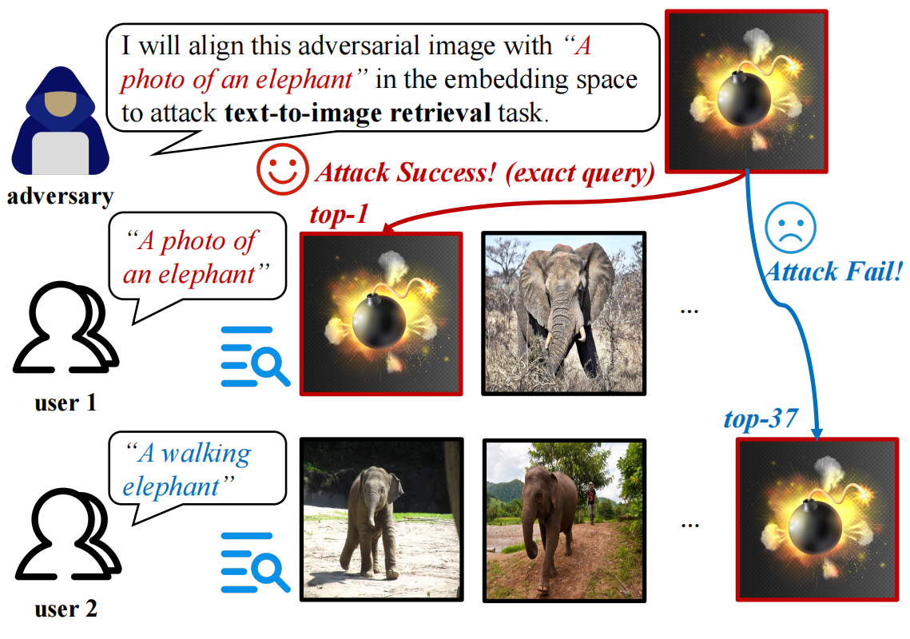
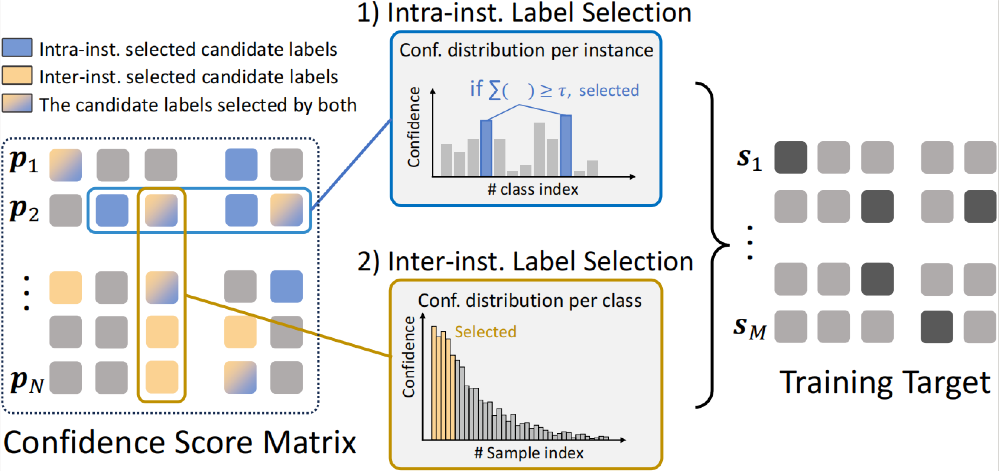

# Jiahan (Han) Zhang

[Email](mailto:jhanzhang01@gmail.com) · [GitHub](https://github.com/vanillaer) · [Google Scholar](https://scholar.google.com/citations?user=lUlcGxIAAAAJ&hl=en) · [LinkedIn](https://www.linkedin.com/in/jiahan-zhang-9039bb213/)

I am a Master’s student in Computer Science at Johns Hopkins University. I have been fortunate to collaborate with Prof. [Lei Feng](https://scholar.google.com/citations?user=KomQOFkAAAAJ&hl=zh-CN&oi=ao) at Southeast University, and Prof. [Alan Yuille](https://scholar.google.com/citations?user=FJ-huxgAAAAJ&hl=en) and Ph.D. candidate [Jieneng Chen](https://scholar.google.com/citations?hl=en&user=yLYj88sAAAAJ) at Johns Hopkins University.

## Research Interests

My research focuses on scalable world models and generative models for embodied agents. I am especially interested in:

* *How should we evaluate the effectiveness and robustness of world models for embodied agents?*
  Unlike entertainment applications that emphasize visual appearance, which metrics best capture real utility for embodied agents—visual fidelity, physical accuracy, embodied task performance, or something else?
* *How can we incorporate more real-world knowledge (physics, semantics, dynamics) into generative models?*
  Current video generation models are trained on diverse web-scale videos that encode real-world knowledge in visual form. Are these visual priors sufficient for physically accurate modeling? If not, how can models learn stronger physical priors from web data, and how can we support this process?
* *How do we transform a video generation model into a unified, scalable world model?*
  How can we leverage web-scale video data and video generation models to build a unified, scalable world model for diverse tasks (e.g., motion generation, robotic policy learning, and scene reconstruction)?

At present, I focus on integrating richer real-world knowledge into generative models. Earlier, I worked on adversarial robustness and weakly supervised learning for large multimodal models, which laid the groundwork for my current research. If you share these interests, please feel free to contact me by email.

---

## Selected Publications & Manuscripts

Recent / [By Year](#)    * denotes equal contribution

### 2025

**World-in-World: World Models in a Closed-Loop World**

**Jiahan Zhang***, Muqing Jiang*, Nanru Dai, Taiming Lu, Arda Uzunoglu, Shunchi Zhang, Yana Wei, Jiahao Wang, Vishal M. Patel, Paul Pu Liang, Daniel Khashabi, Cheng Peng, Rama Chellappa, Tianmin Shu, Alan Yuille, Yilun Du, Jieneng Chen†
Under review 2025

By grounding evaluation in embodied task success rather than visual metrics, World-in-World provides a principled yardstick and a comprehensive framework for assessing the real-world utility of generative world models in embodied settings.

[Paper](https://drive.google.com/uc?export=download&id=1gsl32ZSg83DgwrpB1O-k2YF27vMfTF7C) · [Code](https://github.com/World-In-World/world-in-world) · [Website](https://world-in-world.github.io/)

**Improving Generalizability and Undetectability for Targeted Adversarial Attacks on Multimodal Pre-trained Models**

Zhifang Zhang*, **Jiahan Zhang***, Shengjie Zhou, Qi Wei, Shuo He, Feng Liu, Lei Feng†
Under review 2025

We propose Proxy Targeted Attack (PTA), enabling adversarial examples to generalize to semantically similar targets while remaining on-manifold to evade anomaly detection, revealing a new vulnerability in large multimodal models.

[Paper](https://arxiv.org/pdf/2509.19994)

### 2024

**Candidate Pseudolabel Learning: Enhancing Vision-Language Models by Prompt Tuning with Unlabeled Data**

**Jiahan Zhang***, Qi Wei*, Feng Liu, Lei Feng†
ICML 2024 · **Oral (top 1.4%)**

Candidate Pseudolabel Learning (CPL) fine-tunes VLMs with limited labeled data using candidate label sets and partial-label losses, achieving consistent gains over hard pseudolabeling across nine datasets and three learning paradigms.

[Paper](https://arxiv.org/pdf/2406.10502) · [Code](https://github.com/vanillaer/CPL-ICML2024) · [Website](https://icml.cc/virtual/2024/oral/35456)

---

## All Publications & Manuscripts

1. **C.1**
   **Candidate Pseudolabel Learning: Enhancing Vision-Language Models by Prompt Tuning with Unlabeled Data**
   **Jiahan Zhang*** , Qi Wei*, Feng Liu, Lei Feng† (2024)
   ICML 2024 · **Oral (top 1.4%)**
   [Paper](https://arxiv.org/pdf/2406.10502)

2. **C.2**
   **Influence-Based Fair Selection for Sample-Discriminative Backdoor Attack**
   Qi Wei, Shuo He, **Jiahan Zhang**, Lei Feng, Bo An† (2024/2025)
   AAAI 2025 · **Oral**
   [Paper](https://ojs.aaai.org/index.php/AAAI/article/view/35449/37604)

3. **S.1**
   **World-in-World: World Models in a Closed-Loop World**
   **Jiahan Zhang***, Muqing Jiang*, Nanru Dai, Taiming Lu, Arda Uzunoglu, Shunchi Zhang, Yana Wei, Jiahao Wang, Vishal M. Patel, Paul Pu Liang, Daniel Khashabi, Cheng Peng, Rama Chellappa, Tianmin Shu, Alan Yuille, Yilun Du, Jieneng Chen† (2025)
   Under review
   [Paper](https://drive.google.com/uc?export=download&id=1gsl32ZSg83DgwrpB1O-k2YF27vMfTF7C)

4. **S.2**
   **Improving Generalizability and Undetectability for Targeted Adversarial Attacks on Multimodal Pre-trained Models**
   Zhifang Zhang*, **Jiahan Zhang***, Shengjie Zhou, Qi Wei, Shuo He, Feng Liu, Lei Feng† (2025)
   Under review
   [Paper](https://arxiv.org/pdf/2509.19994)

5. **S.3**
   **EvoWorld: Evolving Panoramic World Generation with Explicit 3D Memory**
   Jiahao Wang, Luoxin Ye, TaiMing Lu, Junfei Xiao, **Jiahan Zhang**, Yuxiang Guo, Xijun Liu, Rama Chellappa, Cheng Peng, Alan Yuille, Jieneng Chen† (2025)
   Under review
   [Paper](#)

---

## Contact

[jhanzhang01@gmail.com](mailto:jhanzhang01@gmail.com) · [GitHub](https://github.com/vanillaer) · [LinkedIn](https://www.linkedin.com/in/jiahan-zhang-9039bb213/) · [Google Scholar](https://scholar.google.com/citations?user=lUlcGxIAAAAJ&hl=en)

---

© Jiahan (Han) Zhang · [Back to top](#jiahan-han-zhang)
